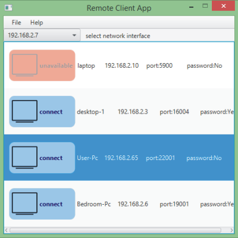
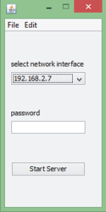
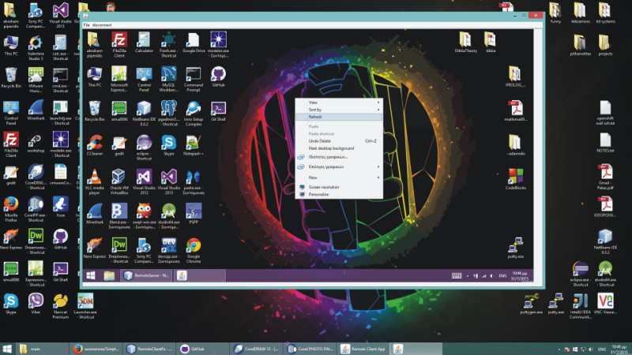

# RemoteDesktop
RemoteDesktopController java/fx/JNI-c++

a Simple java Remote desktop controller. 
currently  testing.  

screenshots  

 

 

 

    <a href="https://twitter.com/PageD_" class="twitter-follow-button" data-show-count="false" data-size="large">Follow @PageD_</a>
    

     

